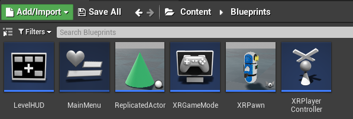
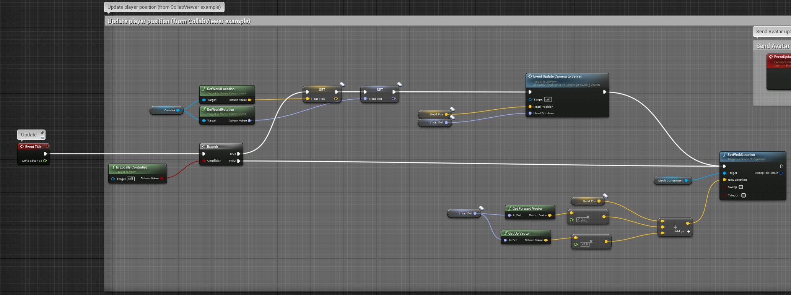
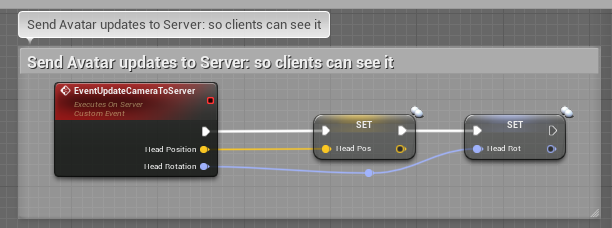

# HL2Collab - HoloLens Multiplayer Networking in Unity

Supported Unreal versions | Supported device | XR configuration
:-----------------: | :----------------: | :----------------------:
Unreal Engine 4.25+ | HoloLens 2 | OpenXR

This sample shows how to network multiple HoloLens 2 devices together using Unreal Engine's built-in networking system. When using the sample, you'll need one instance of the application running as a Listen server. The Listen server is generally run on a desktop. Your client instances of the application can be other HoloLens 2 devices or another desktop.

## Contents

| File/folder | Description |
|-------------|-------------|
| `Config` | HoloLens and default configuration files. |
| `Content` | Project files and assets. |
| `Source` | Mixed Reality Toolkit for Unreal UX Tools plugin components. |
| `images` | Image assets for the README. |
| `.gitignore` | Define what to ignore at commit time. |
| `HL2Collab.sln` | Project solution file. |
| `HL2Collab.uproject` | Unreal Engine project file. |
| `README.md` | This README file. |

## Prerequisites

<!-- Need these -->
Needs OpenXR - need input from Sajid, Jackson, Summer

# Setup

1. Clone or download this sample repository
2. Open the **Level** blueprint in **MainMenuMap** and review the instructions
3. Set the **IP_TextField** variable to your computer's IP Address

## Running the sample 

1. Create a [Desktop build for Windows](https://docs.unrealengine.com/SharingAndReleasing/Deployment/Releasing/index.html) as the host application
2. Create a HoloLens 2 or additional [Desktop builds](https://docs.microsoft.com/windows/mixed-reality/develop/unreal/tutorials/unreal-uxt-ch6#packaging-and-deploying-the-app-via-device-portal) to act as your clients
3. Run the Desktop version and press **H** to begin hosting the map
4. Run the HoloLens 2 clients and **right-pinch** to join the host session at the IP Address provided earlier
5. **(Optional)** Run any other Desktop executables and press **J** to join

## Key concepts

There are two Maps - **MainMenuMap** and **MainMap**:

1. **MainMenuMap:** Takes care of creating sessions. It has the host and client logic, and creates a Menu that displays some information when connecting. The menu doesnt do much. Its meant as a starting point for you to extend.  Important variables in the level blueprint: 
 
    *  **TargetMap**: A string that contains the name of the map the host will load, and clients will connect to.
    *  **IP_TextField**: The IP Address of the host. Its hard-coded for simplicity, but ideally you will want to provide a way for changing this, or discovering it, at runtime.

    There are two important functions that the *MainMenuMap* performs:
    - **Host:** The Host creates a session, and then immediately opens the map/level that it wants all clients to connect to. Since the host is also a player (rather than a dedicated server), we set it to be a *listen* server under the "Open Level" options. Note that the LevelName is passed as a variable string defined in the Level Blueprint . 
 
    - **Join:** Joining is very similar to hosting. The primary difference is that once a session is created, instead of opening a Map/Level by name, we pass the "Open" command an IP address. We used a simple "Execute Console Command" node to do this.
 

2. **MainMap:** This is the Map that clients will connect to. Its main function (other than dsiplaying the level geometry) is to spawn the XRGameMode. This map will make use of the important Blueprint Assets in the Blueprints folder: 

    - **XRGameMode:** Spawns a XRPlayerController and a HUD.Note that it does *not* spawn a Pawn. This is because there will be multiple pawns, one for each client, and we want to ensure that there is logic so that each controller is able to control only its own Pawn. 

    - **XRPlayerController:** Every player will have a single player controller. The XRPlayerController takes care of spawning the avatar for its own client. Since multiple controllers may be replicated to a machine from the server, we need to make sure we are using the "local" player controller, i.e, the one that owns this client. 

    Once we have the correct controller, we can proceed to call the spawning code on the server. The server then replicates this to every client. 

    Note that SpawnAvatar is a custom event, and it is set to "RunOnServer".

    - **XRPawn:** The Pawn/Avatar updates and stores its position and rotation in HeadPos and HeadRot variables every tick.  
  
They are set to "replicate" so that when XRPawn sends this data to the server (again, via a custom event), the server replicates it to all the clients.

## Next steps

<!-- Need links -->